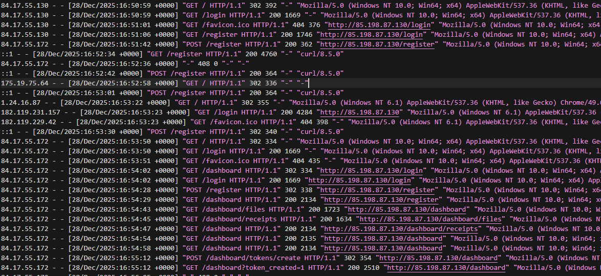
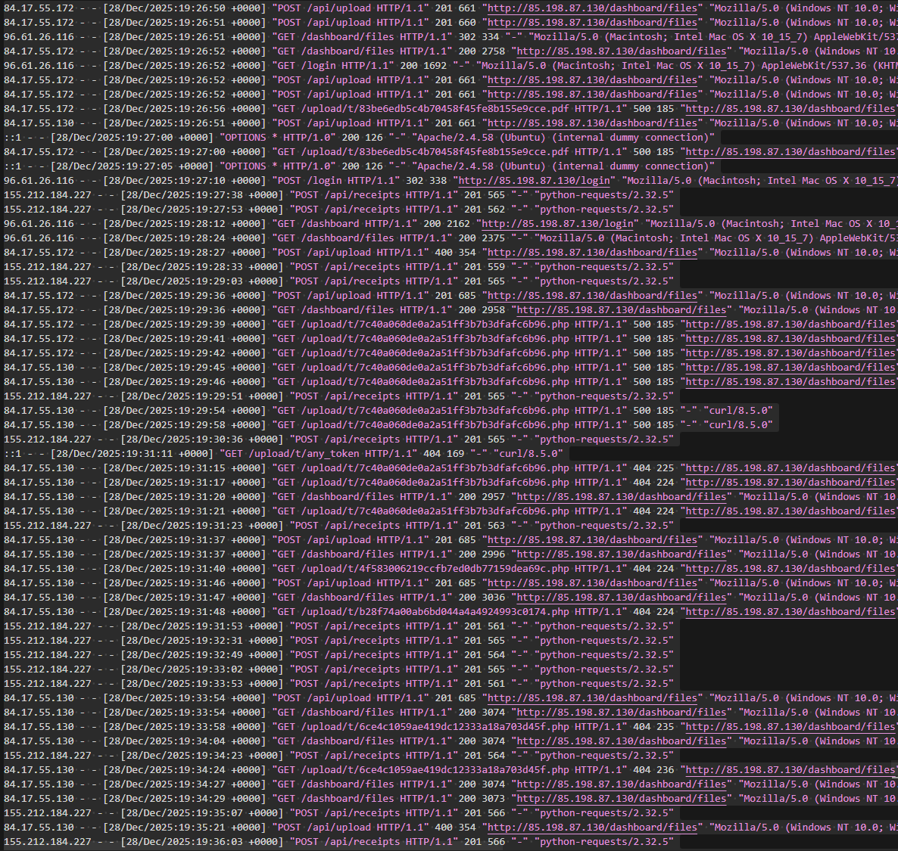
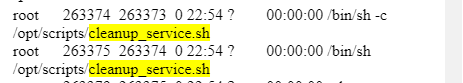
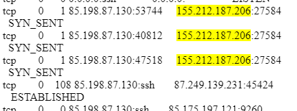
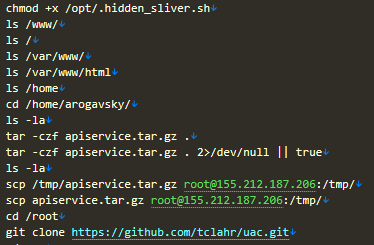
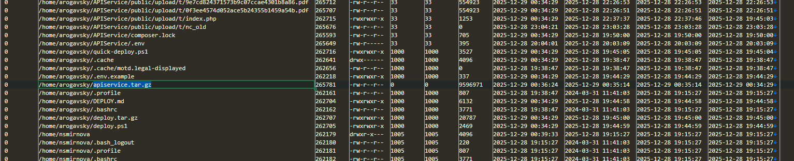

1.Задание. А что произошло?

С какого IP-адреса злоумышленник получил первоначальный доступ к уязвимому сервису?

 Через что получил доступ злоумышленник? (файл на сервере)


goida{}

```javascript
goida{ip;filename}
```


Такс,  у нас есть UAC триаж, который был снят с атакованного линукс сервера

Вначале между всеми логами мы видим доступ с ip который похож на вполне обычный доступ к сервису

 

Далее видим загрузку файла .php и доступ к нему. 

85.175.197.121

 

идем расспрашивать bodyfile

/home/arogavsky/APIService/public/upload/t/7c40a060de0a2a51ff3b7b3dfafc6b96.php 

`2025-12-29 00:34:29,2025-12-28 22:29:36,2025-12-28 22:29:36,2025-12-28 22:29:3`

Ответ будет 

```javascript
goida{85.175.197.121;7c40a060de0a2a51ff3b7b3dfafc6b96.php}
```

---

Задание 2. Повышение привилегий. 

После получения доступа злоумышленник смог повысить привилегии. Какой файл был для этого создан/изменен?(Предоставьте полный путь /) Техника и под техника такого повышения привилегий. На какой IP-адрес и порт подключается malicious cron job для связи с C2 сервером? 


```javascript
goida{/dir/dir/dir/file;1000.01,ip:port}
```

---

Далее видим изменения /opt/scripts/cleanup_service.sh с правами -rwxr-xrwx

`2025-12-28 23:32:01,2025-12-28 23:31:48,2025-12-28 23:31:48,2025-12-28 20:02:45`

Тут за временные уж извините, но создали его до атаки в 20:02
А изменили `23:31`

 

.sh запущен от имени root.

  [Запланированная задача/задание: Cron, подтехника T1053.003 - Enterprise | MITRE ATT&CK®](https://attack.mitre.org/techniques/T1053/003/) 

 

---

и изменение файлов netcat
Не стану утверждать, но помойму тут складывается картинка изменение какого файла
с правами рут и потом использование nc - что как бы с большой долей вероятности реверсшелл.

Но куда?

В  uac-atkqvpliqu-linux-20251228225607\live_response\network\netstat_-a.txt

видим

 


- Видно в процессах: `telnet 155.212.187.206 27584`

- Несколько активных подключений в состоянии SYN_SENT

```javascript
goida{/opt/scripts/cleanup_service.sh;T1053.003,155.212.187.206:27584}
```

---

3 задание. 

Какой скрипт содержит функции для скрытия процесса? Через какую функцию системы Linux было осуществлено сокрытие процесса? Тип ВПО по токсаномии Microsoft? 

```javascript
goida{/dir/filename,*******,Trojan:***/*****}
```

---

Решение 

переходим в 

bodyfile/bodyfile.txt

По временным меткам инцидента видим создание 

/opt/.hidden_sliver.sh

0|/opt/.hidden_sliver.sh|89014|-rwxr-xr-x|0|0|1737|1766957516|1766957516|1766957516|1766957516

  

- Access Time: `1766957516` = 2025-12-28 22:51:56 UTC

- Modify Time: `1766957516` = 2025-12-28 22:51:56 UTC

- Change Time: `1766957516` = 2025-12-28 22:51:56 UTC

- Creation Time: `1766957516` = 2025-12-28 22:51:56 UTC

Права: `-rwxr-xr-x` исполняемый, владелец root

Так же можно заметить

  - `/tmp/libhide.so` (библиотека LD_PRELOAD)

  - `/usr/local/bin/systemd-udevd` (подмененный сервис)

  

**Хронология по временным меткам bodyfile:**

1. **22:51:04** - Создан `/usr/local/bin/systemd-udevd` (подмена системного сервиса)

2. **22:51:56** - Создан `/opt/.hidden_sliver.sh` (скрипт скрытия)


Мы знаем что это Сливер - ищем инфу и находим 

[Looking for the ‘Sliver’ lining: Hunting for emerging command-and-control frameworks | Microsoft Security Blog](https://www.microsoft.com/en-us/security/blog/2022/08/24/looking-for-the-sliver-lining-hunting-for-emerging-command-and-control-frameworks/) 

Внизу ссылки на детекты

[Trojan:Linux/Sliver.A!MTB threat description - Microsoft Security Intelligence](https://www.microsoft.com/en-us/wdsi/threats/malware-encyclopedia-description?Name=Trojan:Linux/Sliver.A!MTB&threatId=-2147142453)  

 

### Trojan:Linux/Sliver.A!MTB


```javascript
goida{/opt/.hidden_sliver.sh,LD_PRELOAD,Trojan:Linux/Sliver.A!MTB}
```


Вообще из занятного можно подчеркнуть что с первого раза все не завелось, а во вторых скрипт маскировал процесс под [kworker]

---

4 Задание. Импакт. Выгрузка данных. 

Доступ к какому файлу или директории был получен злоумышленником? Куда выгрузил? (ip)

Дайте полный путь к файлу который выгрузил злоумышленник.

---

Открываем bash_history

видим 

 


bash history не самый надежный артефакт, но иногда стреляет. Временных меток нет. 

В таких случаях в IR как правило принято опираться на то что есть и то, что вы знаете. Упаковка файлов в архив как будто бы не является базовым минимумом системного администратора, а временные метки мы можем узнать из MFT

 


```javascript
goida{/home/arogavsky/apiservice.tar.gz,155.212.187.206}
```


