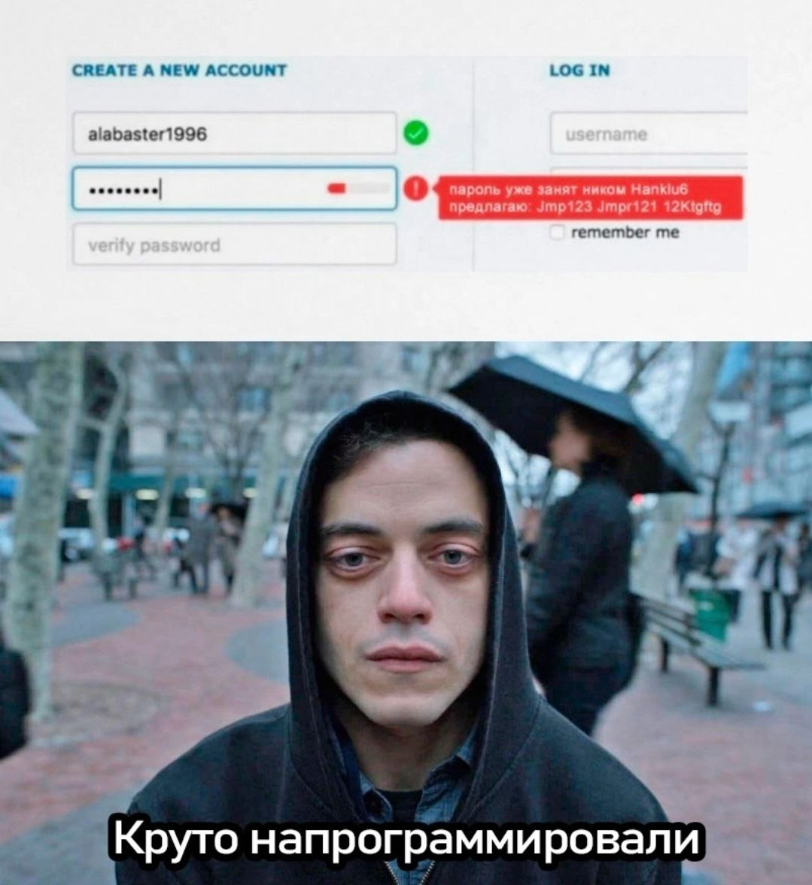

# Навайбкодили - Writeup

## TL;DR
Идея взята из мема:

## Writeup

Перед нами веб-страница с формой регистрации и формой логина. Если покопаться в заминифаеном коде страницы, можно прийти к выводу, что это - единственная веб-страница которая есть, и на ней же должны отображаться заметки при успешном логине. Помимо фронтенда, есть также и бэкенд, который находится по префиксу `/api/`. Больше здесь ничего нет, на что намекает хинт, говорящий, что фаззить пути не требуется.

При инспектировании кода страницы (или после нажатия F12 и просмотре запросов) можно увидеть следующие ручки:
- `POST /check-password-complexity`
- `POST /login`
- `POST /register`
- `GET /posts`
- `POST /logout`

Ручки `/logout` и `/posts` для нас не представляют интереса, ибо требуют авторизационную куку.

Чтобы дернуть ручки `/login` и `/register`, потребуется указать токен каптчи. Для логина требуются креды, а регистрация у сервиса отключена. Рано или поздно эти ручки тоже окажутся отброшены, ибо не выглядят как нужный вектор.

Остаётся странная ручка `/check-password-complexity`. Зачем вообще создавалась отдельная ручка для проверки сложности пароля? К тому же эта ручка не требует указания токена каптчи. Данная ручка возвращает распознанную сложность пароля, а также информацию об ошибке, если таковая имеется. При тестировании различных паролей можно было составить следующие правила составления подходящего для сервиса пароля:
- Длина от 8 до 32 символов включительно (иначе пароль "слишком сложный")
- Обязательно содержит цифру
- Обязательно содержит английскую букву нижнего регистра
- Обязательно содержит английскую букву верхнего регистра
- Обязательно содержит хотя-бы один разрешенный спецсимвол из !"#$%&'()*+,-./:;<=>?@[\]^_`{|}~
- Все символы в пароле из разрешенного диапазона символов (цифры, английские буквы всех регистров и разрешенные спецсимволы)

Название таска и описание (а уж тем более подсказки, которые потом были даны) намекают на то, что здесь должна быть какая-то не предусмотренная вайбкодерская глупость. С учетом того, что в хинте говорится, что в этом таске разрешается слать много запросов, понимаем - нужен перебор.

В завершающей подсказке была дана ссылка на песню от Queen, We Will Rock You. Кстати во-первых надеюсь кто-то заценил, что внутри лежала ссылка на песню, но дисплеелась ссылка на рикролл, это пасхалка. Во-вторых я знал, что на ютубе эта песня заблокирована для IP из РФ, поэтому ссылка такая была дана специально, чтобы намекнуть на одно - стандартный вордлист паролей из Kali под названием `rockyou.txt`.

Но вот незадача - внутри него содержится более 14 миллионов паролей, перебирать такое кол-во можно целую вечность, да и звучит это очень глупо. Вспоминаем, что пароль пользователя в сервисе должен придерживаться правилам, которые были определены выше. Фильтруем пароли, для этого можно было написать такой скрипт: [`./filter_passwords.py`](./filter_passwords.py). После фильтрации видим, что правилам парольной политики сервиса придерживаются лишь... чуть больше 47 тысяч паролей. Это многое говорит об обществе, так мало паролей действительно стойкие (игнорируем конечно же пароли большие по длине, чем 32 символа и non-ASCII пароли). Чтож, зато такое количество вполне реально довольно быстро прогнать на ручке!

Брутим пароль и находим ошибку вайбкодеров: сервис уведомляет, если вдруг пароль уже используется другим пользователем. Так и находятся все учетные записи. Если посмотреть внутри записок (у каждого пользователя были свои записки), одним из пользователей окажется `elliot`, внутри его записок (они кстати были смешные) находим флаг.

P.S.: вопреки названию, таск не был навайбкожен :) Это придуманный лор для того, чтобы лишний раз дать социальный комментарий - не вайбкодьте в прод пж!

### Анинтендед облегчение таска

На самом деле данный таск подразумевал некоторое усложнение. Чтобы люди не стали бессмысленно брутфорсить 14 миллионов паролей на ручку, и поняли, что здесь требуется сделать что-то умное ~~(а также чтобы еще помучать)~~ ещё до того, как таск был засолвнут, был добавлен лимитинг запросов на ручку `/check-password-complexity` - не более 10 запросов в секунду. Сложности также добавляло бы то, что респонз у этой ручки всегда при проверке пароля `200`, а статус можно узнать по тексту ошибки внутри поля. Нужная учетка при таком условии сбрутилась бы за 2 минуты, зато заставило бы либо поиграться с параметрами бурпа для смены кол-ва запросов в секунду, либо пришлось бы писать свой скрипт брутфорса.

По какой-то причине изменение это видимо не развернулось, поэтому решать это было легче. Однако это изменение присутствует в этом репозитории, если вдруг решите сами запустить и порешать
